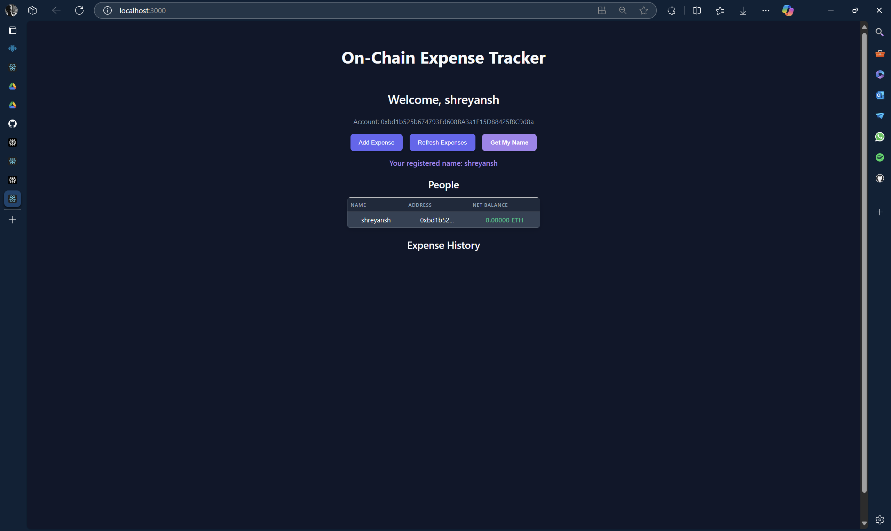
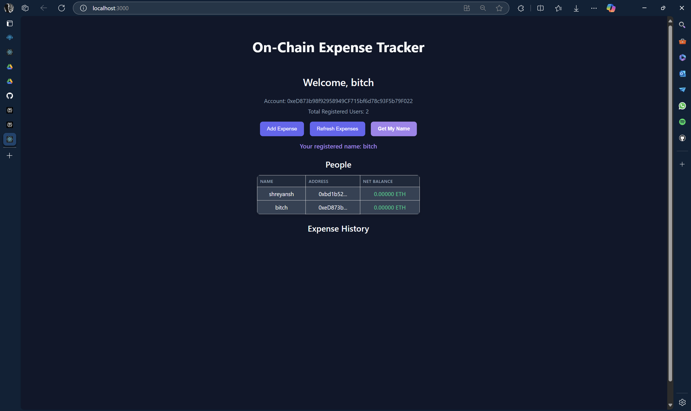

# Expense Splitter DApp

This DApp allows users to transparently split and track expenses on the blockchain. It leverages smart contracts for secure and transparent record-keeping, and a React-based frontend for user interaction.

---

## Key Features

### 1. Get My Name

**Description:**  
Allows any registered user to fetch their own registered name directly from the smart contract.

#### How It Works

- The Solidity contract provides a `getMyName()` function.
- When a user clicks the **"Get My Name"** button in the DApp, it calls this function.
- The function returns the name associated with the connected wallet address.
- If the user is not registered, an error message is shown.

#### Solidity Contract
```function getMyName() public view returns (string memory) {
require(
  people[msg.sender].walletAddress != address(0),
  "You are not registered"
  );
  return people[msg.sender].name;
}
```

#### Frontend (React Example)

```
const [myFetchedName, setMyFetchedName] = useState("");
const [isFetchingName, setIsFetchingName] = useState(false);

const handleGetMyName = async () => {
  setIsFetchingName(true);
  try {
    const name = await contract.getMyName();
    setMyFetchedName(name);
  } catch (err) {
    setMyFetchedName("Not registered or error fetching name.");
  }
  setIsFetchingName(false);
};
```

#### The above code results in

---

### 2. Get Total Number of Registered Users

**Description:**  
Displays the total number of users who have registered on the platform.

#### Frontend (React Example)

```
<p>Total Registered Users: {people.length}</p>
```
#### The above code results in

---
